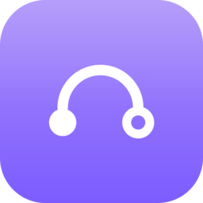
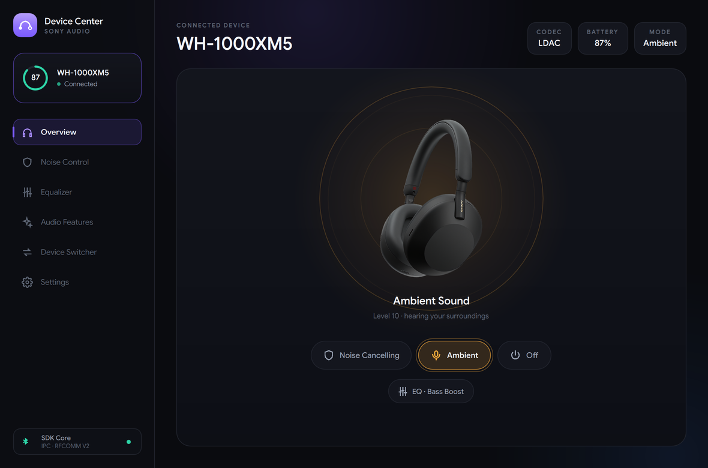
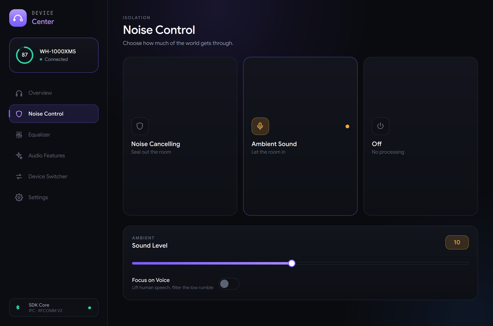
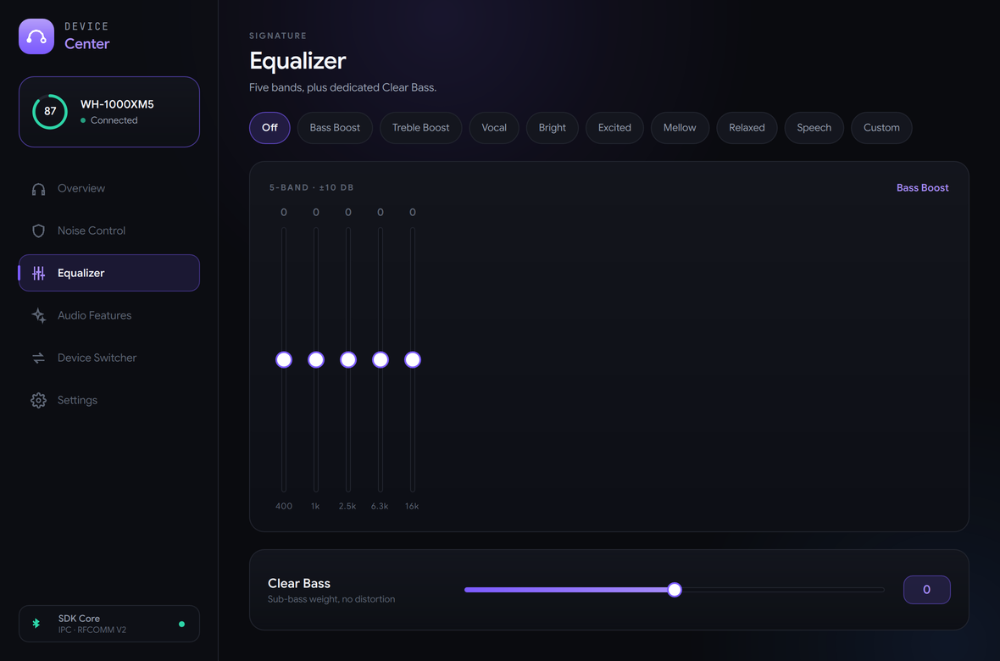
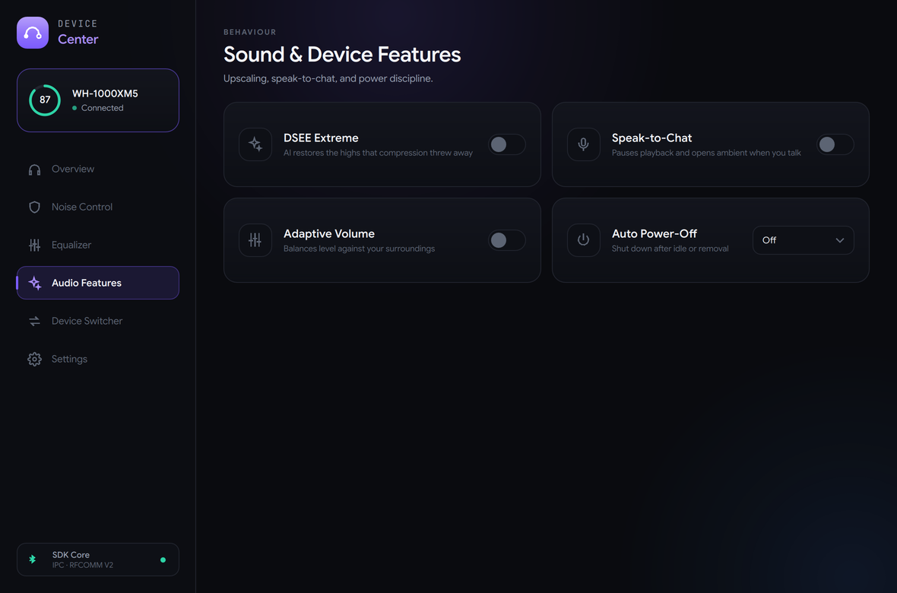

# Sony Device Center

**An open-source desktop suite and C++20 SDK for Sony headphones and earbuds — Ambient Sound, Noise Cancelling, Equalizer, Clear Bass, DSEE, battery monitoring, and device control, without needing a mobile phone.**

---

## Overview

Sony locks headphone settings and telemetry behind their mobile-only apps (*Sony Headphones Connect* / *Sound Connect*).

**Sony Device Center** communicates directly with Sony headphones over Bluetooth RFCOMM using Sony's reverse-engineered binary protocol. It provides:

- **`sony-device-center`** — A modern, dark-themed **Qt 6 / QML** desktop companion application.
- **`sonyctl`** — A fast, scriptable **CLI tool** for instant terminal controls and scripting.
- **`sonyd`** — A lightweight **background daemon** managing the Bluetooth link and exposing a local IPC socket.
- **`sony-protocol` / `sony-transport` / `sony-core`** — Modular, decoupled **C++20 libraries** for integration into third-party tools and desktop environments.

---

## 📸 Screenshots



| Noise Control | Equalizer | Audio Features |
| :---: | :---: | :---: |
|  |  |  |

<sub>Captured on Linux/Wayland against `sonyd --simulated`, the daemon's built-in device simulator.</sub>

---

## ✨ Features

- 🎚️ **Noise Control** — Active Noise Cancelling (ANC), Ambient Sound (levels 1–20), and Off modes.
- 🗣️ **Focus on Voice** — Toggle speech-priority voice passthrough while suppressing low-frequency noise.
- 🎛️ **Full Equalizer** — Switch between built-in presets (Bright, Excited, Vocal, Bass Boost, Treble Boost, etc.) or dial in custom 5-band frequencies and Clear Bass (-10 to +10).
- ✨ **DSEE Extreme** — Enable or disable Sony's AI-based audio upscaling for compressed audio.
- 🔋 **Live Battery & Charging State** — Real-time telemetry for over-ear models, plus individual Left, Right, and Case battery levels for True Wireless (TWS) earbuds.
- 🧩 **Advanced Audio Features** — Speak-to-Chat, Adaptive Volume, and Auto Power-Off timeouts (dynamically enabled based on device capability profiles).
- 🧬 **Dual Protocol Support** — Automatically detects and communicates with both **Protocol V1** (legacy models) and **Protocol V2** (modern models with alternating-bit Stop-and-Wait ARQ).
- 💻 **Flexible Architecture** — Run standalone via direct Bluetooth transport, or as a background daemon with CLI and GUI clients.

---

## 🎧 Supported Devices

Status reflects what someone has actually run, not what the protocol suggests
should work. A device is only **Verified** once a person reports it working on
real hardware.

| Device | Protocol | Status | Notes |
| :--- | :---: | :--- | :--- |
| **WH-1000XM5** | V2 | ✅ Verified | Maintainer's device |
| **WH-1000XM3** | V1 | ✅ Verified | Maintainer's device |
| **WH-1000XM6** | V2 | ⚠️ Partially working | Controls work; **equalizer has no effect** ([#10](../../issues/10)), battery intermittent ([#11](../../issues/11)) |
| **WF-1000XM6** | V2 | ✅ Verified | Community report |
| **MDR-1000X** | V1 | ❌ Known broken | Shows as disconnected, no controls work ([#12](../../issues/12)) |
| **WH-1000XM4** | V1 | ✅ Verified | Community report (firmware 3.0.1, Windows): battery, noise control readback, EQ + Clear Bass, firmware, codec |
| WF-1000XM5, WF-1000XM4 | V2 | 🟡 Untested | TWS battery reporting unverified |
| WH-CH720N, ULT WEAR, LinkBuds S, WF-C700N | V2 | 🟡 Untested | |
| WH-XB910N, WH-CH520 | V2 | 🟡 Untested | |
| WH-XB900N, MDR-XB950BT, WI-1000X, WH-1000XM2 | V1 | 🟡 Untested | The V1 path is far less exercised than V2 |

**State and connection handling:** the Qt app now uses structured snapshots,
updates from supported device notifications, and periodic refreshes. It shows
unknown readings and command errors explicitly. The daemon retries unavailable
headphones automatically. V1 battery, noise-control and equalizer readback is
decoded and verified on a WH-1000XM4; the XM3 uses the same opcodes but has not
been re-tested since. Model-specific XM6 protocol
failures still need hardware verification. See [IPC and connection lifecycle](docs/ipc-and-lifecycle.md).

Running something not listed, or listed as untested? Please
[open a report](../../issues/new) with your model, firmware version and what worked —
that is the only way this table improves. `sonyctl -v info` output is ideal.

---

## 🚀 Building from Source

### Prerequisites

- **Compiler**: C++20 compliant compiler (`gcc` 11+, `clang` 14+, or MSVC 2022)
- **Build System**: CMake 3.16+ and Ninja or Make
- **GUI Framework**: Qt 6 (`Core`, `Gui`, `Qml`, `Quick`, `QuickControls2`)
- **Bluetooth Stack**:
  - **Linux**: BlueZ (`libbluetooth-dev`, `libdbus-1-dev`)
  - **Windows**: Native Winsock & Bluetooth (`ws2_32.lib`, `bthprops.lib` included with Windows SDK)
  - **macOS**: `IOBluetooth` and `Foundation` frameworks

### Linux (Ubuntu, Debian, Fedora, Arch)

1. **Install dependencies**:
   ```bash
   # Ubuntu / Debian
   sudo apt update && sudo apt install -y \
       build-essential cmake git \
       libbluetooth-dev libdbus-1-dev libglfw3-dev \
       qt6-base-dev qt6-declarative-dev qml6-module-qtquick-controls

   # Fedora
   sudo dnf install -y \
       gcc-c++ cmake git \
       bluez-libs-devel dbus-devel glfw-devel \
       qt6-qtbase-devel qt6-qtdeclarative-devel
   ```

2. **Install submodules**:
   ```bash
   git submodule update --init --recursive
   ```

3. **Configure and compile**:
   ```bash
   cmake -B build -S . -DCMAKE_BUILD_TYPE=Release
   cmake --build build --parallel
   ```

4. **Run tests**:
   ```bash
   ctest --test-dir build --output-on-failure
   ```

### macOS

1. **Install dependencies** with [Homebrew](https://brew.sh). You also need the Xcode Command Line Tools (`xcode-select --install`).
   ```bash
   brew install cmake qt
   ```

2. **Configure and compile**:
   ```bash
   cmake -B build -S . -DCMAKE_BUILD_TYPE=Release -DCMAKE_PREFIX_PATH="$(brew --prefix qt)"
   cmake --build build --parallel
   ```

3. **Run tests**:
   ```bash
   ctest --test-dir build --output-on-failure
   ```

4. **Start the app**:
   ```bash
   open build/apps/device-center/sony-device-center.app
   ```

The build makes an app bundle that uses the Qt frameworks from Homebrew. The bundle runs only on a Mac with Homebrew Qt installed. There is no prebuilt macOS download at this time.

### Windows

From a **Developer Command Prompt for VS 2022** (or PowerShell with MSVC):
```cmd
cmake -B build -S . -DCMAKE_PREFIX_PATH="C:\Qt\6.x.x\msvc2022_64" -DCMAKE_BUILD_TYPE=Release
cmake --build build --config Release --parallel
```

---

## 💻 Usage & Applications

### 1. Modern Desktop GUI (`sony-device-center`)

Launch the Qt 6 application directly:
```bash
./build/apps/device-center/sony-device-center
```
On macOS, open the app bundle with `open build/apps/device-center/sony-device-center.app`.

On Unix, a running `sonyd` is used over local IPC. Otherwise the app opens a direct Bluetooth session. Windows currently uses direct sessions. Discovery and device I/O run off the GUI thread. Update the GUI and daemon together for the versioned IPC interface.

### 2. Command-Line Interface (`sonyctl`)

`sonyctl` provides instant control from your shell or keyboard shortcuts:

```bash
# Telemetry and status
sonyctl status                  # Connection status and model
sonyctl info                    # Full device specs, firmware, codec, and capabilities
sonyctl battery                 # Battery percentage and charging indicator
sonyctl devices                 # List discovered paired Sony devices

# Noise control
sonyctl anc on                  # Enable Noise Cancelling
sonyctl anc off                 # Turn off Noise Cancelling
sonyctl ambient 10              # Set Ambient Sound level (1 to 20)
sonyctl ambient off             # Turn off Ambient Sound

# Equalizer and sound tuning
sonyctl eq get                  # Display current preset and 5-band EQ
sonyctl eq bass-boost           # Switch to preset (bright, excited, vocal, bass-boost, etc.)
sonyctl eq custom 5 0 1 2 1 0   # Custom Clear Bass (+5) and bands: 400Hz, 1kHz, 2.5kHz, 6.3kHz, 16kHz
sonyctl dsee on                 # Enable DSEE audio upscaling
sonyctl apo 3                   # Set Auto Power-Off preset (0=Off, 1=5m, 2=15m, 3=30m, 4=1h, 5=3h)

# Standalone execution (stop sonyd first; only one Bluetooth owner is allowed)
sonyctl --direct battery
sonyctl --direct anc on
```

### 3. Background Daemon (`sonyd`)

Run headless in the background or configure as a systemd user service:
```bash
# Run foreground/background
./build/apps/sonyd/sonyd &

# Run with custom socket path
mkdir -p "$HOME/.cache/sony-device-center"
chmod 700 "$HOME/.cache/sony-device-center"
./build/apps/sonyd/sonyd -s "$HOME/.cache/sony-device-center/ipc.sock"
```

To run as a systemd service:
```bash
cp packaging/linux/sonyd.service ~/.config/systemd/user/
systemctl --user daemon-reload
systemctl --user enable --now sonyd.service
```

---

## 🔬 Architecture & Technical Details

### Framing & Serialization

Packets transmitted over Bluetooth RFCOMM follow the Sony MDR framed format:

```
[START 0x3E] ESCAPE( [TYPE 1B] [SEQ 1B] [LENGTH 4B Big-Endian] [PAYLOAD ...] [CHECKSUM 1B] ) [END 0x3C]
```

- **Escaping**: Special bytes `0x3C`, `0x3D`, `0x3E` are escaped with `0x3D` followed by their byte subtracted by `0x10`.
- **Alternating-Bit ARQ**: The protocol uses a 1-bit sequence counter (`0` or `1`). Incoming ACK packets specify the sequence number expected for the subsequent transmission, ensuring reliable in-order transport.
- **Service Discovery**:
  - **Protocol V1**: Service UUID `96CC203E-50F8-4944-9C22-EDCB48F6216F`
  - **Protocol V2**: Service UUID `956C7B26-B496-4447-AD7B-3A47900D8C86`

### Automated Test Suite

The CTest suite includes protocol, transport, service, Unix IPC, Qt worker, and simulated application tests without requiring Bluetooth hardware:
- Frame framing, escaping, checksums, and corruption recovery
- Fragmentation handling and multi-frame stream parsing
- V1 vs. V2 command byte layouts and safe opcode handling
- Transport simulation with fault injection, simulated timeouts, and disconnects
- IPC protocol serialization roundtrips and end-to-end Unix domain socket client/server tests

```bash
ctest --test-dir build --output-on-failure
```

---

## 📚 References & Prior Art

This project builds upon the foundational reverse-engineering work of the open-source audio community:

- **[SonyHeadphonesClient](https://github.com/Plutoberth/SonyHeadphonesClient)** by Plutoberth, Mr-M33533K5 & contributors — The original cross-platform client that decoded Sony's first-generation Bluetooth protocol.
- **[Gadgetbridge](https://codeberg.org/Freeyourgadget/Gadgetbridge)** — Open-source Android companion app providing extensive protocol specifications and reverse-engineering insights for modern Sony devices.
- **[SonyBridge](https://github.com/AmitRajput-Dev/SonyBridge)** by Amit Rajput — Early exploration into second-generation V2 command layouts.

---

## 🤖 How this was built

This project was written with heavy AI assistance, and it is worth being direct about
what that means for anyone deciding whether to trust or contribute to it.

What it does **not** mean is that the behaviour is unverified. The protocol layer has
111 tests that run without any hardware, covering framing, escaping, checksums,
fragmentation, and the V1/V2 generation boundary — including a regression test proving
a legacy device is never sent opcode `0x22`, which means POWER OFF there and BATTERY on
newer models. Sanitizers run in CI on every push.

What it does mean is that breadth outran verification in places. Device support claims
were, until recently, inferred from protocol similarity rather than tested — the table
above now says which is which — and the community found real bugs at launch that the
test suite did not cover. Those are tracked in the open issues rather than papered over.

Judge it on the tests and the issue list, not on the authorship. Bug reports, and
especially hardware reports, are the most valuable thing you can contribute.

---

## ⚠️ Disclaimer

Sony Device Center is an **independent open-source project**, free for anyone to use,
study and modify. It is **not affiliated with, endorsed by, or connected to Sony
Corporation**. Sony and all product names are trademarks of their respective owners.
It communicates with the headphones over a reverse-engineered protocol, for
interoperability.

---

## 📄 License

Distributed under the [MIT License](LICENSE).
